# AN IMAGE IS WORTH 16X16 WORDS: TRANSFORMERS FOR IMAGE RECOGNITION AT SCALE

## 摘要

虽然 Transformer 架构已成为自然语言处理任务的事实标准，但其在计算机视觉中的应用仍然有限。在视觉中，注意力要么与卷积网络结合使用，要么用于替换卷积网络的某些组件，同时保持其整体结构不变。我们表明，这种对 CNN 的依赖是不必要的，直接应用于图像patch序列的纯transformer可以很好地执行图像分类任务。当对大量数据进行预训练并转移到多个中小型图像识别基准（ImageNet、CIFAR-100、VTAB 等）时，Vision Transformer (ViT) 与最先进的卷积网络相比获得了最好的结果，同时需要更少的计算资源来训练。(1.Fine-tuning code and pre-trained models are available at https://github.com/ google-research/vision_transformer)

## 1.引言

基于自注意的架构，尤其是 Transformers（Vaswani 等人，2017 年），已成为自然语言处理 (NLP) 中的首选模型。主要方法是在大型文本语料库上进行预训练，然后在较小的特定任务数据集上进行微调（Devlin 等人，2019 年）。得益于 Transformer 的计算效率和可扩展性，训练具有超过 100B 参数的空前规模的模型成为可能（Brown 等人，2020 年；Lepikhin 等人，2020 年）。随着模型和数据集的增长，性能仍然没有饱和的迹象。

然而，在计算机视觉中，卷积架构仍然占主导地位（LeCun 等人，1989 年；Krizhevsky 等人，2012 年；He 等人，2016 年）。受 NLP 成功的启发，多项工作尝试将类似 CNN 的架构与自注意力相结合（Wang 等人，2018 年；Carion 等人，2020 年），其中一些工作完全取代了卷积（Ramachandran 等人，2019 年；Wang 等人。 , 2020a).后一种模型虽然在理论上是有效的，但由于使用了专门的注意力模式，因此尚未在现代硬件加速器上有效扩展。因此，在大规模图像识别中，类似 ResNet 的经典架构仍然是最先进的（Mahajan 等人，2018 年；Xie 等人，2020 年；Kolesnikov 等人，2020 年）。

受 NLP 中 Transformer 扩展成功的启发，我们尝试将标准 Transformer 直接应用于图像，并进行尽可能少的修改。为此，我们将图像拆分为多个patch，并提供这些patch的线性embeddings序列作为 Transformer 的输入。在 NLP 应用中，图像patch的处理方式与token（单词）相同。我们以监督方式训练图像分类模型。

当在没有强正则化的情况下对 ImageNet 等中型数据集进行训练时，这些模型产生的精度适中，比同等规模的 ResNet 低几个百分点。这种看似令人沮丧的结果可能是意料之中的：Transformers 缺乏 CNN 固有的一些归纳偏差，例如平移等变性和局部性，因此在训练数据量不足时不能很好地泛化。

但是，如果模型是在更大的数据集（14M-300M 图像）上训练的，情况就会发生变化。我们发现大规模训练胜过归纳偏差。我们的 Vision Transformer (ViT) 在经过足够规模的预训练并转移到数据点较少的任务时取得了出色的结果。当在公共 ImageNet-21k 数据集或室内 JFT-300M 数据集上进行预训练时，ViT 在多个图像识别基准测试中接近或击败了最先进的技术。特别是，最佳模型在 ImageNet 上达到了 88.55% 的准确率，在 ImageNet-RealL 上达到了 90.72%，在 CIFAR-100 上达到了 94.55%，在 19 个任务的 VTAB 套件上达到了 77.63%。

## 2.相关工作

Transformer是由 Vaswani 等人(2017)提出的用于机器翻译，此后已成为许多 NLP 任务中最先进的方法。基于大型 Transformer 的模型通常在大型语料库上进行预训练，然后针对手头的任务进行微调：BERT（Devlin 等人，2019 年）使用去噪自监督预训练任务，而 GPT 工作线使用语言建模作为其预训练任务（Radford 等人，2018 年；2019 年；Brown 等人，2020 年）。

将自注意力简单地应用于图像需要每个像素都关注其他所有像素。由于像素数量的二次成本，这不会扩展到实际的输入大小。因此，为了在图像处理的上下文中应用Transformer，过去已经尝试了几种近似方法。Parmar等 (2018) 仅在每个query像素的局部邻域而不是全局应用自注意力。这种局部多头点积自注意力块可以完全取代卷积（Hu et al., 2019; Ramachandran et al., 2019; Zhao et al., 2020）。在另一项工作中，Sparse Transformers（Child 等人，2019 年）采用可扩展的全局自注意力近似值以适用于图像。另一种扩展注意力的方法是将其应用于不同大小的块（Weissenborn 等人，2019 年），在极端情况下，仅沿单个轴（Ho 等人，2019 年；Wang 等人，2020a）。许多这些专门的注意架构在计算机视觉任务上展示了有希望的结果，但需要复杂的工程才能在硬件加速器上有效地实现。

与我们最相关的是 Cordonnier 等人的模型。 (2020)，它从输入图像中提取大小为 2 × 2 的patch，并在顶部应用完全自注意力。该模型与 ViT 非常相似，但我们的工作更进一步证明，大规模预训练可使 vanilla transformers 与最先进的 CNN 相媲美（甚至更好）。此外，Cordonnier 等人(2020) 使用 2 × 2 像素大小的小patch，这使得该模型仅适用于小分辨率图像，而我们也处理中分辨率图像。

人们也对将卷积神经网络 (CNN) 与自注意力形式相结合产生了很多兴趣，例如通过增强图像分类的特征图（Bello 等人，2019 年）或使用自注意力进一步处理 CNN 的输出，例如用于对象检测（Hu et al., 2018; Carion et al., 2020）、视频处理（Wang et al., 2018; Sun et al., 2019）、图像分类（Wu et al., 2020）、无监督对象发现 (Locatello et al., 2020)，或统一的文本视觉任务 (Chen et al., 2020c; Lu et al., 2019; Li et al., 2019)。

另一个最近的相关模型是图像 GPT（iGPT）（Chen 等人，2020a），它在降低图像分辨率和颜色空间后将 Transformers 应用于图像像素。该模型以无监督方式作为生成模型进行训练，然后可以对生成的表示进行微调或线性探测以提高分类性能，从而在 ImageNet 上实现 72% 的最大准确度。

我们的工作增加了越来越多的论文集，这些论文集探索比标准 ImageNet 数据集更大规模的图像识别。使用额外的数据源可以在标准基准上实现最先进的结果（Mahajan 等人，2018 年；Touvron 等人，2019 年；Xie 等人，2020 年）。此外，Sun 等人 (2017) 研究 CNN 性能如何随数据集大小而变化，Kolesnikov 等人 (2020);乔隆加等人(2020) 从 ImageNet-21k 和 JFT-300M 等大规模数据集对 CNN 迁移学习进行实证探索。我们也关注后两个数据集，但训练 Transformer 而不是之前工作中使用的基于 ResNet 的模型。

## 3.方法

在模型设计中，我们尽可能地遵循原始的 Transformer（Vaswani 等人，2017）。这种有意设计的简单设置的一个优点是可扩展的 NLP Transformer 架构——及其高效的实现——几乎可以开箱即用。

### 3.1 VISION TRANSFORMER(VIT)

图 1 描绘了该模型的概览。标准 Transformer 接收一维token embedding序列作为输入。为了处理二维图像，我们将图像$x \in \mathbb{R}^{H \times W \times C}$reshape为一系列flattened的二维patch$x_p \in \mathbb{R}^{N \times (P^2 \centerdot C)}$，其中 (H, W) 是原始图像的分辨率，C 是通道数，(P, P) 是每个图像patch的分辨率，$N=HW/P^2$是产生的patch数，它也作为 Transformer 的有效输入序列长度。 Transformer 在其所有层中使用恒定的潜在向量大小 D，因此我们将patch展平并使用可训练的线性投影映射到 D 维度（等式 1）。我们将此投影的输出称为patch embedding。

类似于 BERT 的 [class] 标记，我们在embedding的patch序列前添加一个可学习的embedding($z^0_0=x_{class}$)，其在 Transformer 编码器($z^0_L$)输出的状态用作图像表示 y (Eq. 4).在预训练和微调期间，分类头都连接到$z^0_L$ 。分类头在预训练时由一个隐藏层的 MLP 实现，在微调时由一个线性层实现。

位置embedding被添加到patch embedding中以保留位置信息。我们使用标准的可学习 1D 位置embedding，因为我们没有观察到使用更先进的 2D 感知位置embedding（附录 D.4）带来的显着性能提升。生成的embedding向量序列用作编码器的输入。

Transformer 编码器（Vaswani 等人，2017 年）由多头自注意力（MSA，参见附录 A）和 MLP 块（方程式 2、3）的交替层组成。 Layernorm (LN) 在每个块之前应用，在每个块之后应用残差连接（Wang et al., 2019; Baevski & Auli, 2019）。 MLP 包含两个具有 GELU 非线性的层。
$$
z_0=[x_{class};x^1_pE;x^2_pE;\dots;x^N_pE] + E_{pos}, \quad E\in \mathbb{R}^{(P^2 \cdot C)\times D}, \ E_{pos} \in \mathbb{R}^{(N+1)\times D}
$$

$$
z^{\prime}_{\ell} = MSA(LN(z_{\ell-1})) + z_{\ell - 1}, \quad \ell=1\dots L
$$

$$
z_{\ell} = MLP(LN(z^{\prime}_{\ell})) + z^{\prime}_{\ell}, \quad \ell = 1 \dots L
$$

$$
y = LN(z^0_L)
$$

**归纳偏置**	我们注意到 Vision Transformer 的图像特定归纳偏差比 CNN 少得多。在 CNN 中，局部性、二维邻域结构和平移等方差被烘焙到整个模型的每一层中。在 ViT 中，只有 MLP 层是局部和平移等变的，而自注意力层是全局的。二维邻域结构的使用非常谨慎：在模型开始时将图像切割成patch，在微调时调整不同分辨率图像的位置embedding（如下所述）。除此之外，初始化时的位置embedding不包含关于patch的二维位置的信息，patch之间的所有空间关系都必须从头开始学习。

**混合架构**	作为原始图像patch的替代方案，输入序列可以由 CNN 的特征图形成（LeCun 等人，1989）。在这个混合模型中，patch embedding投影 E（等式 1）应用于从 CNN 特征图中提取的patch。作为一种特殊情况，patch可以具有 1x1 的空间大小，这意味着输入序列是通过简单地展平特征图的空间维度并投影到 Transformer 维度来获得的。如上所述添加分类输入embedding和位置embedding。

### 3.2 FINE-TUNING AND HIGHER RESOLUTION

通常，我们在大型数据集上预训练 ViT，然后微调到（较小的）下游任务。为此，我们删除了预训练的预测头并附加了一个零初始化的$D \times K$前馈层，其中 K 是下游类的数量。以比预训练更高的分辨率进行微调通常是有益的（Touvron 等人，2019 年；Kolesnikov 等人，2020 年）。当提供更高分辨率的图像时，我们保持patch大小相同，这会导致更大的有效序列长度。 Vision Transformer 可以处理任意序列长度（取决于内存限制），但是，预训练的位置embedding可能不再有意义。因此，我们根据预训练位置embedding在原始图像中的位置对它们执行二维插值。请注意，此分辨率调整和patch提取是唯一将图像二维结构的感应偏差手动注入 Vision Transformer 的点。

## 4.实验

我们评估了 ResNet、Vision Transformer (ViT) 和混合网络的表征学习能力。为了了解每个模型的数据要求，我们对不同大小的数据集进行了预训练，并评估了许多基准任务。在考虑预训练模型的计算成本时，ViT 表现非常出色，以较低的预训练成本在大多数识别基准上达到了最先进的水平。最后，我们使用自监督进行了一个小实验，并表明自监督的 ViT 在未来有希望。

### 4.1 设置

**数据集**	为了探索模型的可扩展性，我们使用具有 1k 类和 1.3M 图像的 ILSVRC-2012 ImageNet 数据集（我们在下文中将其称为 ImageNet），其超集 ImageNet-21k 具有 21k 类和 14M 图像（Deng 等人，2009 年） ), 和 JFT (Sun et al., 2017) 具有 18k 类和 303M 高分辨率图像。我们按照Kolesnikov等人(2020)的方法，将预训练数据集与下游任务的测试集进行去重。我们将在这些数据集上训练的模型转移到几个基准任务：ImageNet on the original validation labels and the cleaned-up ReaL labels (Beyer et al., 2020), CIFAR-10/100 (Krizhevsky, 2009), Oxford-IIIT Pets （Parkhi 等人，2012 年）和 Oxford Flowers-102（Nilsback 和 Zisserman，2008 年）。对于这些数据集，预处理遵循 Kolesnikov 等人（2020）的方法。

我们还评估了 19 任务 VTAB 分类套件（Zhai 等人，2019b）。 VTAB 评估低数据传输到不同的任务，每个任务使用 1000 个训练示例。这些任务分为三组：自然任务——如上述任务、宠物、CIFAR 等。专业任务——医学和卫星图像，以及结构化任务——需要几何理解的任务，如定位。

**模型变体**	我们将 ViT 配置基于用于 BERT 的配置（Devlin 等人，2019），如表 1 所示。“Base”和“Large”模型直接从 BERT 中采用，我们添加了更大的“Huge”模型。在下文中，我们使用简短的符号来表示模型大小和输入patch大小：例如，ViT-L/16 表示具有 16×16 输入patch大小的“大”变体。请注意，Transformer 的序列长度与patch大小的平方成反比，因此具有较小patch大小的模型在计算上更昂贵。

对于基线 CNN，我们使用 ResNet (He et al., 2016)，但将Batch Normalization层 (Ioffe & Szegedy, 2015) 替换为组归一化 (Wu & He, 2018)，并使用标准化卷积 (Qiao et al. , 2019).这些修改改进了传输（Kolesnikov 等人，2020），我们将修改后的模型表示为“ResNet (BiT)”。对于混合体，我们将中间特征图以一个“像素”的patch大小输入 ViT。为了试验不同的序列长度，我们要么 (i) 获取常规 ResNet50 的第 4 阶段的输出，要么 (ii) 移除第 4 阶段，在第 3 阶段放置相同数量的层（保持总层数），然后取这个扩展阶段 3 的输出。选项 (ii) 导致序列长度增加 4 倍，以及更昂贵的 ViT 模型。

**训练和微调**	我们使用 Adam (Kingma & Ba, 2015) 训练所有模型，包括 ResNets，其中$\beta_1 = 0.9, \beta_2 = 0.999$，batch size为 4096，并应用 0.1 的高权重衰减，我们发现这对于转移所有模型有用（附录 D.1 表明，与常见做法相比，在我们的设置中，对于 ResNets，Adam 的效果略好于 SGD）。我们使用线性学习率预热和衰减，详见附录 B.1。对于微调，我们使用带动量的 SGD，batch size为 512，对于所有模型，请参见附录 B.1.1。对于表 2 中的 ImageNet 结果，我们在更高分辨率下进行了微调：ViT-L/16 为 512，ViT-H/14 为 518，还使用了 Polyak & Juditsky (1992) 平均系数为 0.9999（Ramachandran 等人., 2019; Wang 等人, 2020b).

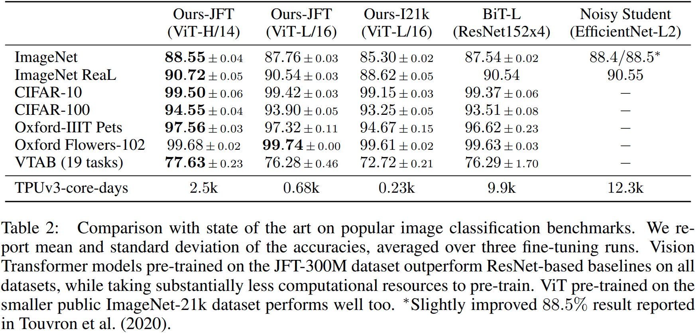

**度量**	我们通过小样本或微调精度报告下游数据集的结果。在对各自的数据集进行微调后，微调精度会捕获每个模型的性能。通过解决将训练图像子集的（冻结）表示映射到$\{-1, 1\}^k$目标向量的正则化最小二乘回归问题来获得few-shot精度。该公式使我们能够以封闭形式恢复精确解。虽然我们主要关注微调性能，但有时我们会使用线性few-shot精度进行快速即时评估，而微调成本太高。

### 4.2 与最先进技术对比

我们首先将我们最大的模型——ViT-H/14 和 ViT-L/16——与文献中最先进的 CNN 进行比较。第一个比较点是 Big Transfer (BiT)（Kolesnikov 等人，2020），它使用大型 ResNet 执行监督迁移学习。第二个是 Noisy Student (Xie et al., 2020)，这是一个大型 EfficientNet，使用 ImageNet 和 JFT-300M 上去除了标签进行的半监督学习训练。目前，在此处报告的其他数据集上，Noisy Student 是 ImageNet 和 BiT-L 上的最新技术。所有模型都在 TPUv3 硬件上进行了训练，我们报告了预训练每个模型所花费的 TPUv3 核心天数，即用于训练的 TPU v3 核心数（每个芯片 2 个核心）乘以训练所用天数。

表 2 显示了结果。在 JFT-300M 上预训练的较小 ViT-L/16 模型在所有任务上都优于 BiT-L（在同一数据集上预训练），同时训练所需的计算资源要少得多。更大的模型 ViT-H/14 进一步提高了性能，尤其是在更具挑战性的数据集——ImageNet、CIFAR-100 和 VTAB 套件上。有趣的是，与现有技术水平相比，该模型进行预训练所需的计算量仍然少得多。然而，我们注意到预训练效率可能不仅受到架构选择的影响，还可能受到其他参数的影响，例如训练schedule、优化器、权重衰减等。我们提供了针对不同架构的性能与计算的对照研究在第 4.4 节。最后，在公共 ImageNet-21k 数据集上预训练的 ViT-L/16 模型在大多数数据集上也表现良好，同时预训练占用的资源更少：它可以使用8核的标准云 TPUv3 进行训练，大约 30 天。

图 2 将 VTAB 任务分解为各自的组，并与该基准测试中之前的 SOTA 方法进行了比较：BiT、VIVI——在 ImageNet 和 Youtube 上共同训练的 ResNet（Tschannen 等人，2020 年），以及 S4L——ImageNet 上的监督加半监督学习（Zhai 等人，2019a）。 ViT-H/14 在自然和结构化任务上优于 BiT-R152x4 和其他方法。在专业任务上，前两个模型的性能相似。

### 4.3 预训练数据要求

在大型 JFT-300M 数据集上进行预训练时，Vision Transformer 表现良好。与 ResNets 相比，视觉归纳偏差更少，数据集大小有多重要？我们进行了两个系列的实验。

首先，我们在规模不断增加的数据集上预训练 ViT 模型：ImageNet、ImageNet-21k 和 JFT-300M。为了提高较小数据集的性能，我们优化了三个基本的正则化参数——weight decay、dropout 和 label smoothing。图 3 显示了对 ImageNet 微调后的结果（其他数据集的结果如表 5 所示）(2.请注意，ImageNet 预训练模型也进行了微调，但同样是在 ImageNet 上。这是因为微调期间分辨率的增加提高了性能)。当在最小的数据集 ImageNet 上进行预训练时，ViT-Large 模型与 ViT-Base 模型相比表现不佳，尽管（适度）正则化。使用 ImageNet-21k 预训练，它们的性能相似。只有 JFT-300M，我们才能看到更大型号的全部优势。图 3 还显示了不同大小的 BiT 模型所跨越的性能区域。 BiT CNN 在 ImageNet 上优于 ViT，但对于更大的数据集，ViT 超过。

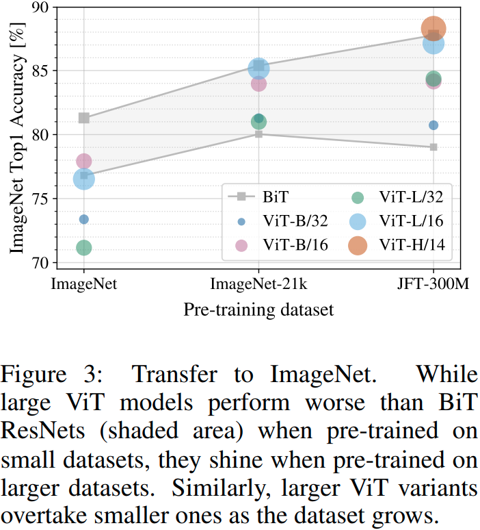

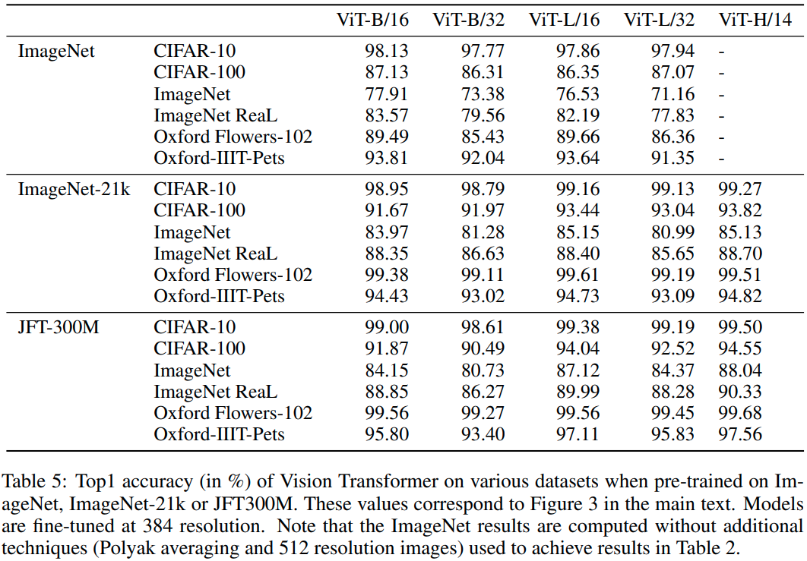

其次，我们在 9M、30M 和 90M 的随机子集以及完整的 JFT-300M 数据集上训练我们的模型。我们不对较小的子集执行额外的正则化，并对所有设置使用相同的超参数。这样，我们评估了模型的内在属性，而不是正则化的影响。然而，我们确实使用提前停止，并报告在训练期间达到的最佳验证准确性。为了节省计算，我们报告了few-shot线性精度而不是完整的微调精度。图 4 包含结果。 使用相当计算成本的Vision Transformers 在较小数据集上比ResNet 更容易出现过拟合问题。例如，ViT-B/32 比 ResNet50 稍快；它在 9M 子集上表现更差，但在 90M+ 子集上表现更好。 ResNet152x2 和 ViT-L/16 也是如此。这个结果强化了这样一种直觉，即卷积归纳偏置对较小的数据集很有用，但对于较大的数据集，直接从数据中学习相关模式就足够了，甚至是有益的。

总的来说，ImageNet 上的小样本结果（图 4）以及 VTAB 上的低数据结果（表 2）似乎对非常低的数据迁移学习很有希望。进一步分析 ViT 的小样本特性是未来工作的一个令人兴奋的方向。

### 4.4 扩展性研究

我们通过评估 JFT-300M 的迁移性能来对不同模型进行受控扩展研究。在此设置中，数据大小不会成为模型性能的瓶颈，我们评估每个模型的性能与预训练成本。模型集包括：7个ResNets，R50x1，R50x2 R101x1，R152x1，R152x2，预训练7个epoch，加上R152x2和R200x3预训练14个epoch； 6个Vision Transformers，ViT-B/32、B/16、L/32、L/16，预训练7个epoch，加上L/16和H/14预训练14个epoch；和 5 个混合体，R50+ViT-B/32、B/16、L/32、L/16 预训练了 7 个epoch，加上 R50+ViT-L/16 预训练了 14 个epoch（对于混合体，数字在模型名称的末尾不代表patch大小，而是代表 ResNet backbone中的总下采样率）。

图 5 包含迁移性能与总预训练计算的关系（有关计算成本的详细信息，请参阅附录 D.5）。附录中的表 6 提供了每个模型的详细结果。可以观察到一些模式。首先，Vision Transformers 在性能/计算权衡方面主导 ResNet。 ViT 使用大约 2-4 倍更少的计算来获得相同的性能（平均超过 5 个数据集）。其次，混合模型在小的计算预算下略胜 ViT，但对于更大的模型，差异消失了。这个结果有点令人惊讶，因为人们可能期望卷积局部特征处理能够在任何规模下辅助 ViT。第三，Vision Transformers 似乎没有在尝试的范围内饱和，这激发了未来的扩展努力。

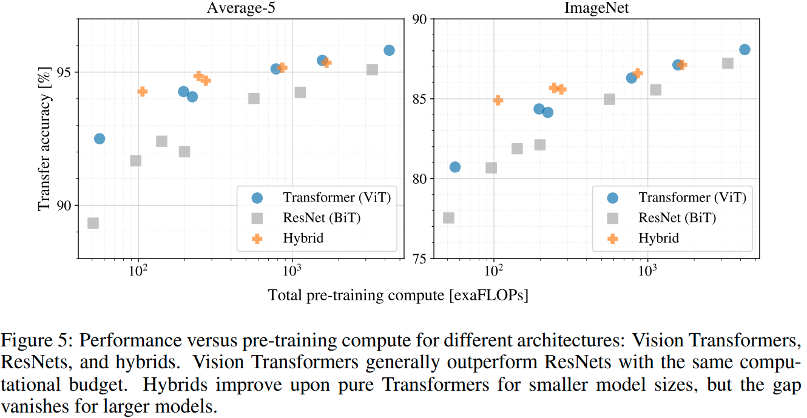

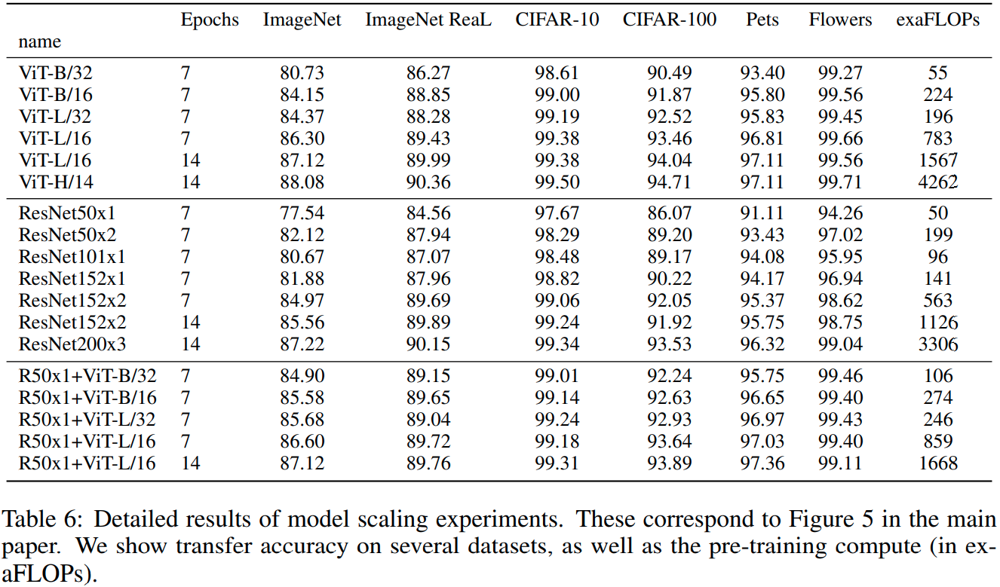

### 4.5 检测视觉Transformer

为了开始了解 Vision Transformer 如何处理图像数据，我们分析了它的内部表示。 Vision Transformer 的第一层将扁平化的patch线性投影到低维空间（等式 1）。图 7（左）显示了学习的embedding过滤器的主要成分。这些组件类似于合理的基函数，用于每个patch内精细结构的低维表示。

投影后，将学习的位置embedding添加到patch表示中。图 7（中）显示该模型学习在位置embedding的相似性中对图像内的距离进行编码，即更近的patch往往具有更相似的位置embedding。进一步，出现了行列结构；同一行/列中的patch具有相似的embedding。最后，对于较大的网格，有时会出现正弦结构（附录 D）。位置embeddding学习表示 2D 图像拓扑解释了为什么手工制作的 2D 感知embedding变体没有产生改进（附录 D.4）。

Self-attention 允许 ViT 整合整个图像的信息，即使是在最低层。我们调查网络在多大程度上利用了这种能力。具体来说，我们根据注意力权重计算图像空间中集成信息的平均距离（图 7，右）。这种“注意力距离”类似于 CNN 中的感受野大小。我们发现一些头已经关注了最低层中的大部分图像，表明模型确实使用了全局整合信息的能力。其他注意力头在低层的注意力距离一直很小。这种高度局部化的注意力在 Transformer 之前应用 ResNet 的混合模型中不太明显（图 7，右），这表明它可能起到与 CNN 中早期卷积层类似的作用。此外，注意力距离随着网络深度的增加而增加。在全局范围内，我们发现该模型关注与分类语义相关的图像区域（图 6）。

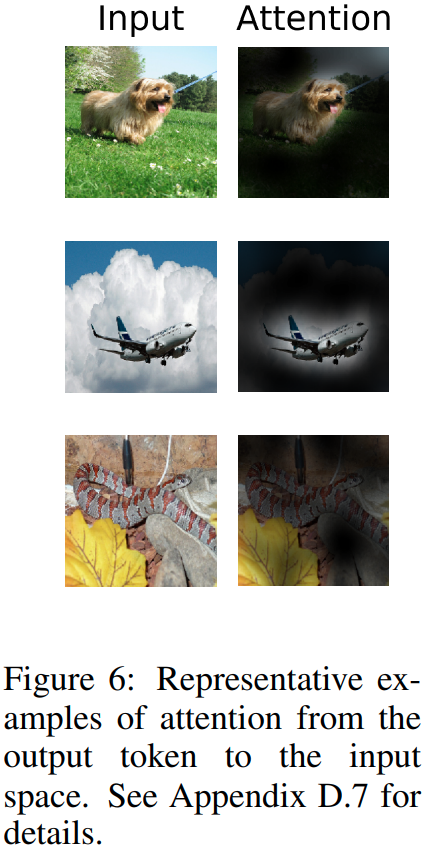

### 4.6 自监督

Transformer在 NLP 任务上表现出色。然而，他们的成功在很大程度上不仅源于其出色的可扩展性，还源于大规模的自监督预训练（Devlin 等人，2019 年；Radford 等人，2018 年）。我们还对用于自监督的掩码patch预测进行了初步探索，模仿了 BERT 中使用的掩码语言建模任务。通过自监督预训练，我们较小的 ViT-B/16 模型在 ImageNet 上达到了 79.9% 的准确率，比从头训练有 2% 的显着提高，但仍落后监督预训练 4%。附录 B.1.2 包含更多详细信息。我们将探索对比预训练（Chen 等人，2020b；He 等人，2020；Bachman 等人，2019；Henaff 等人，2020）留给未来的工作

## 5.结论

我们已经探索了Transformers在图像识别中的直接应用。与之前在计算机视觉中使用自我注意的工作不同，除了初始patch提取步骤之外，我们不会将特定于图像的归纳偏差引入架构中。相反，我们将图像解释为一系列patch，并通过 NLP 中使用的标准 Transformer 编码器对其进行处理。当与大型数据集的预训练相结合时，这种简单但可扩展的策略效果出奇地好。因此，Vision Transformer 在许多图像分类数据集上达到或超过了最先进的水平，同时预训练相对便宜。

尽管这些初步结果令人鼓舞，但仍然存在许多挑战。一种是将 ViT 应用于其他计算机视觉任务，例如检测和分割。我们的结果，加上 Carion 等人的结果。 (2020)，指出这种方法的前景。另一个挑战是继续探索自监督的预训练方法。我们最初的实验表明自监督预训练有所改进，但自监督和大规模监督预训练之间仍然存在很大差距。最后，进一步扩展 ViT 可能会提高性能。

## 附录

## A 多头自注意力

标准 qkv self-attention (SA, Vaswani et al. (2017)) 是一种流行的神经架构构建模块。对于输入序列 $z \in \mathbb{R}^{N \times D}$中的每个元素，我们计算序列中所有值 v 的加权和。注意力权重$A_{ij}$基于序列的两个元素之间的成对相似性及其各自的query $q^i$和 key $k^j$ 表示。
$$
[q, k, v] = zU_{qkv} \qquad U_{qkv} \in \mathbb{R}^{D \times 3D_h},
$$

$$
A = softmax(qk^T/\sqrt{D_h}) \qquad A \in \mathbb{R}^{N \times N},
$$

$$
SA(z) = Av.
$$

Multihead self-attention (MSA) 是 SA 的扩展，我们在其中并行运行 k 个自注意力操作，称为“heads”，并投射它们的concat输出。为了在更改 k 时保持计算和参数数量不变，Dh（等式 5）通常设置为 D/k。
$$
MSA(z) = [SA_1(z); SA_2(Z); \dots; SA_k(z)]U_{msa} \qquad U_{msa} \in \mathbb{R}^{k \cdot D_h \times D}
$$

## B 实验细节

### B.1 训练

表 3 总结了我们不同模型的训练设置。我们发现在 ImageNet 上从头开始训练模型时，强正则化是关键。使用时，Dropout 应用于除 qkv-projections 之外的每个密集层之后，并直接在将位置embedding 添加到 patch embedding 之后应用。混合模型使用与 ViT 对应模型完全相同的设置进行训练。最后，所有的训练都是在 224 分辨率上完成的。

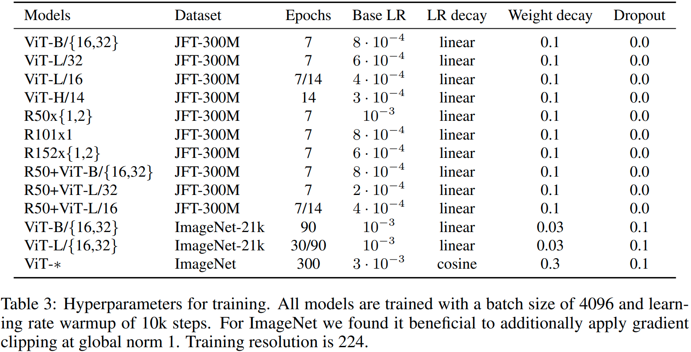

#### B.1.1 微调

我们使用动量为 0.9 的 SGD 微调所有 ViT 模型。我们对学习率运行一个小的网格搜索，见表 4 中的学习率范围。为此，我们使用训练集中的小子集分割（10% 用于宠物和鲜花，2% 用于 CIFAR，1% ImageNet）作为开发集并对剩余数据进行训练。对于最终结果，我们在整个训练集上进行训练并在各自的测试数据上进行评估。对于微调 ResNet 和混合模型，我们使用完全相同的设置，唯一的例外是 ImageNet，我们在学习率扫描中添加了另一个值 0.06。此外，对于 ResNets，我们还运行 Kolesnikov 等人的设置(2020) 并在本次运行和我们的扫描中选择最佳结果。最后，如果没有另外说明，所有微调实验都以 384 分辨率运行（以与训练不同的分辨率运行微调是常见的做法（Kolesnikov 等人，2020 年））。

将 ViT 模型转移到另一个数据集时，我们移除整个头部（两个线性层）并将其替换为单个零初始化线性层，输出目标数据集所需的类数。我们发现这比简单地重新初始化最后一层更可靠。

对于 VTAB，我们遵循 Kolesnikov 等人的协议 (2020)，并对所有任务使用相同的超参数设置。我们使用 0.01 的学习率并训练 2500 步（表 4）。我们通过对两个学习率和两个schedule进行小规模扫描，并在 200 个示例验证集上选择具有最高 VTAB 分数的设置来选择此设置。我们遵循 Kolesnikov 等人(2020)使用的预处理，除了我们不使用特定于任务的输入分辨率。相反，我们发现 Vision Transformer 从所有任务的高分辨率 (384 × 384) 中获益最多。

#### B.1.2 自监督

我们采用masked patch预测目标进行初步的自监督实验。为此，我们破坏了 50% 的patch embedding，方法是用可学习的 [mask] embedding (80%)、随机的其他patch embedding (10%) 或保持原样 (10%) 替换它们的embedding。此设置与 Devlin 等人（2019）用于语言的设置非常相似。最后，我们使用各自的patch表示来预测每个损坏patch的 3 位平均颜色（即总共 512 种颜色）。

我们在 JFT 上以 4096 的batch size训练了 1M 步（约 14 个epoch）的自监督模型。我们使用 Adam，基础学习率为$2 \cdot 10^{-4}$，预热 10k 步，余弦学习率衰减。作为预训练的预测目标，我们尝试了以下设置：1）仅预测平均值，3 位颜色（即 1 次预测 512 种颜色），2）并行预测具有 3 位颜色的 16 × 16 patch的 4 × 4 缩小版本（即 512 种颜色的 16 次预测），3）使用 L2 对完整patch进行回归（即 3 个 RGB 通道上的 256 次回归）。令人惊讶的是，我们发现一切都运行良好，尽管 L2 稍差一些。我们仅报告选项 1) 的最终结果，因为它显示出最佳的 few-shot 性能。我们还试验了 Devlin 等人(2019)使用的 15% 的损坏率，但我们的 few-shot 指标的结果也略差。

最后，我们想指出的是，我们对masked patch预测的实例化不需要如此大量的预训练，也不需要像 JFT 这样的大型数据集，就可以在 ImageNet 分类上获得类似的性能提升。也就是说，我们观察到在 100k 预训练步骤后下游性能的提高逐渐变小，并且在 ImageNet 上进行预训练时看到类似的收益。

## C 其他结果

我们报告了与论文中提供的数字相对应的详细结果。表 5 对应于论文中的图 3，显示了在大小不断增加的数据集上预训练的不同 ViT 模型的迁移性能：ImageNet、ImageNet-21k 和 JFT-300M。表 6 对应于论文中的图 5，显示了 ViT、ResNet 和不同大小的混合模型的迁移性能，以及预训练的估计计算成本。

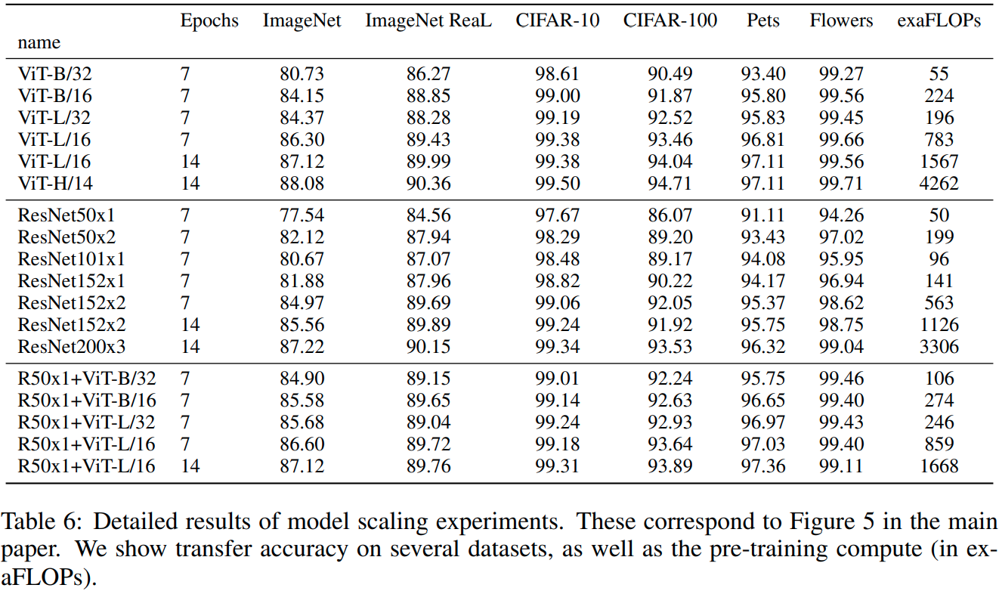

## D 额外分析

### D.1 SGD vs. ADAM FOR RESNETS

ResNets 通常使用 SGD 进行训练，我们使用 Adam 作为优化器是非常不寻常的。在这里，我们展示了激发这一选择的实验。也就是说，我们比较了两个 ResNets 的微调性能——50x1 和 152x2——在 JFT 上用 SGD 和 Adam 预训练。对于 SGD，我们使用 Kolesnikov 等人（2020）推荐的超参数。结果如表 7 所示。Adam 预训练在大多数数据集上的平均表现优于 SGD 预训练。这证明了选择 Adam 作为用于在 JFT 上预训练 ResNets 的优化器是合理的。请注意，绝对数字低于 Kolesnikov 等人(2020)报告的数字，因为我们只预训练了 7 个epoch，而不是 30 个epoch。

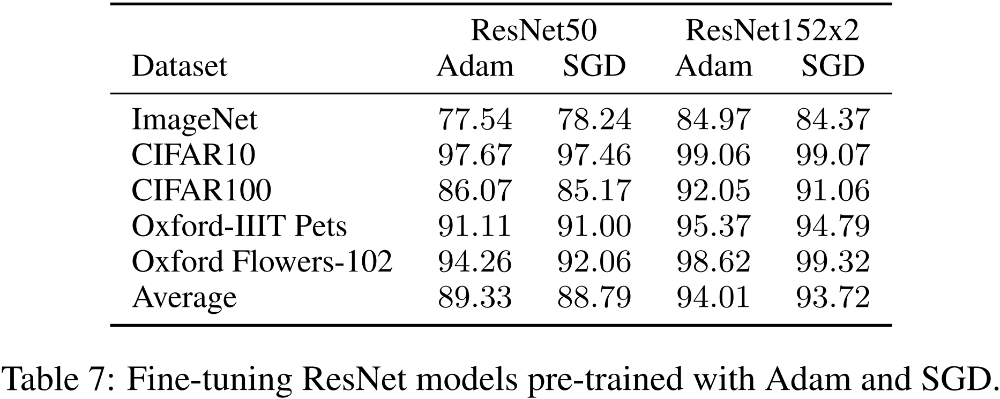

### D.2 Transformer形状

我们对 Transformer 架构的不同维度进行了消融，以找出最适合扩展到超大型模型的维度。图 8 显示了 ImageNet 上不同配置的 5-shot 性能。所有配置均基于具有 8 层的 ViT 模型，D = 1024，$D_{MLP} = 2048$，patch大小为 32，所有线的交集。我们可以看到，缩放深度会带来最大的改进，直到 64 层都清晰可见。然而，在 16 层之后已经可以看到收益递减。有趣的是，缩放网络的宽度似乎会导致最小的变化。减少patch大小，从而增加有效序列长度，在不引入参数的情况下显示出惊人的稳健改进。这些发现表明，计算可能是比参数数量更好的性能预测指标，并且缩放比例应该强调深度而不是宽度（如果有的话）。总的来说，我们发现按比例缩放所有维度会带来稳健的改进。

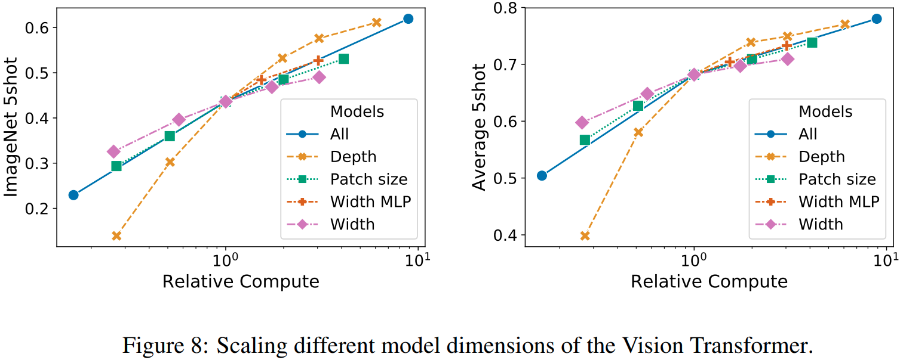

### D.3 HEAD TYPE AND CLASS TOKEN

为了尽可能接近原始的 Transformer 模型，我们使用了一个额外的 [class] token，将其用作图像表示。然后通过一个小型多层感知器 (MLP) 将此token的输出转换为类别预测，其中 tanh 作为单个隐藏层中的非线性。

这种设计继承自文本的 Transformer 模型，我们在整篇论文中都使用它。最初尝试仅使用图像patch embedding、全局平均池化 (GAP) 它们，然后是线性分类器——就像 ResNet 的最终特征图一样——效果很差。然而，我们发现这既不是由于额外的token，也不是由于 GAP 操作。相反，性能差异完全可以用不同学习率的要求来解释，请参见图 9。

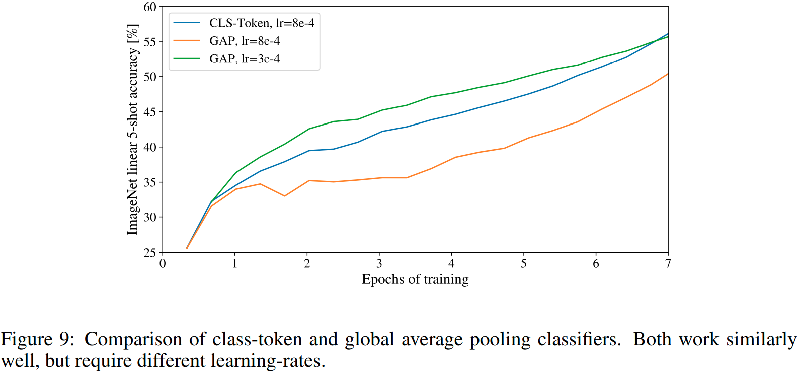

### D.4 位置 embedding

我们对使用位置 embedding 对空间信息进行编码的不同方式进行了消融。我们尝试了以下案例：

- 不提供位置信息：将输入视为一袋patch。
- 一维位置 embedding：将输入视为栅格顺序中的一系列patch（本文所有其他实验的默认设置）。
- 二维位置 embedding：将输入视为二维的 patch 网格。在这种情况下，学习了两组 embedding，每组对应一个轴，即 X-embedding 和 Y-embedding，每个 embedding 的大小为 D/2。然后，根据输入路径上的坐标，我们concat X 和 Y embedding 以获得该patch的最终位置embedding。
- 相对位置 embedding：考虑 patch 之间的相对距离来编码空间信息而不是它们的绝对位置。为此，我们使用一维相对注意力，在其中我们定义了所有可能的 patch 对的相对距离。因此，对于每个给定的对（一个作为 query，另一个作为注意力机制中的 key/value），我们有一个偏移量 $p_q - p_k$，其中每个偏移量都与一个 embedding 相关联。然后，我们简单地运行额外的注意力，我们使用原始query（query 的内容），但使用相对位置 embedding 作为 key。然后，我们使用相对注意力的对数作为偏差项，并在应用 softmax 之前将其添加到主要注意力（基于内容的注意力）的对数中。

除了编码空间信息的不同方式外，我们还尝试了将这些信息合并到我们的模型中的不同方式。对于 1 维和 2 维位置 embedding，我们尝试了三种不同的情况：(1) 在模型的主干之后和将输入提供给 Transformer 编码器之前，将位置 embedding 添加到输入中（本文所有其他实验默认设置）； (2) 学习位置 embedding 并将其添加到每一层开始的输入； (3) 在每一层的开始处向输入添加学习的位置 embedding（层间共享）。

表 8 总结了 ViT-B/16 模型消融研究的结果。正如我们所见，虽然没有位置 embedding 的模型和有位置 embedding 的模型的性能存在很大差距，但不同的位置信息编码方式之间几乎没有差异。我们推测，由于我们的 Transformer 编码器在 patch 级输入上运行，而不是像素级，因此如何编码空间信息的差异不太重要。更准确地说，在 patch 级输入中，空间维度比原始像素级输入小得多，例如 14 × 14 而不是 224 × 224，学习以这种分辨率表示空间关系对于这些不同的位置编码策略同样容易。即便如此，网络学习的位置 embedding 相似性的具体模式取决于训练超参数（图 10）。

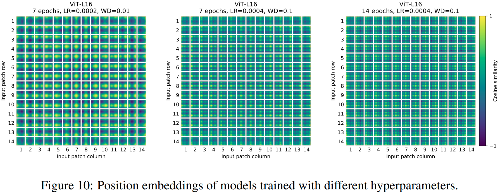

### D.5 经验性计算成本

我们还对我们硬件上架构的实际速度感兴趣，由于通道宽度和缓存大小等细节，理论上的 FLOPs 并不总是能很好地预测到这一点。为此，我们在 TPUv3 加速器上对主要感兴趣的模型进行推理速度计时；推理和反向传播速度之间的差异是一个恒定的模型无关因素。

图 12（左）显示了一个内核每秒可以处理多少图像，涉及各种输入大小。每一个点都指的是在广泛的 batch size 范围内测得的峰值性能。可以看出，对于最大分辨率的最大模型，ViT 的理论双二次缩放才会发生，而且只会发生在相对较小的程度上。

另一个有趣的量是每个模型可以适合核心的最大 batch size，越大越好扩展到大型数据集。图 12（右）显示了同一组模型的这个数量。这表明大型 ViT 模型在内存效率方面比 ResNet 模型具有明显优势。

### D.6 AXIAL ATTENTION

Axial Attention（Huang 等人，2020 年；Ho 等人，2019 年）是一种简单而有效的技术，可以对组织为多维 tensor 的大输入进行自注意力。axial attention 的一般思想是执行多个注意力操作，每个都沿着输入 tensor 的单个轴，而不是将一维注意力应用于输入的扁平版本。在 axial attention 中，每个注意力都混合沿特定轴的信息，同时保持沿其他轴的信息独立。沿着这条线，Wang 等人。 (2020b) 提出了 AxialResNet 模型，其中 ResNet50 中所有内核大小为 3 × 3 的卷积都被轴向自注意力取代，即行和列注意力，并通过相对位置编码得到增强。我们已将 AxialResNet 实施为 baseline 模型。(3.我们的实现基于 https://github.com/csrhddlam/axial-deeplab 中的开源 PyTorch 实现。在我们的实验中，我们在准确性方面重现了 (Wang et al., 2020b) 中报告的分数，但是，与开源实现类似，我们的实现在 TPU 上非常慢。因此，我们无法将其用于广泛的大规模实验。这些可以通过精心优化的实现来解锁。)

此外，我们修改了 ViT 以处理二维形状的输入，而不是一维的 patch 序列，并合并了 Axial Transformer 块，其中后面接上一个MLP而不是自注意力，我们使用一个 row-self-attention 加一个 MLP，接着一个 column-self-attention 加一个 MLP。

图 13，展示了 Axial ResNet、Axial-ViT-B/32 和 Axial-ViT-B/16 在 ImageNet 5shot linear 上的性能，当在 JFT 数据集上进行预训练时，对比预训练计算，包括 FLOP 数和推理时间（例如每秒）。正如我们所见，Axial-ViT-B/32 和 Axial-ViT-B/16 在性能方面都优于 ViT-B 对应物，但这是以更多计算为代价的。这是因为在 Axial-ViT 模型中，每个具有全局自注意力的 Transformer 块被两个 Axial Transformer 块替换，一个具有行自注意力，一个具有列自注意力，尽管自注意力操作的序列长度在轴向情况下更小，每个 Axial-ViT 块都有一个额外的 MLP。对于 AxialResNet，虽然它在准确性/计算权衡方面看起来合理（图 13，左），但在 TPU 上的简单实现非常慢（图 13，右）。

### D.7 ATTENTION DISTANCE

为了解 ViT 如何使用自注意力来整合图像中的信息，我们分析了不同层的注意力权重跨越的平均距离（图 11）。这种“注意力距离”类似于 CNN 中的感受野大小。较低层的头部之间的平均注意力距离变化很大，一些头部关注图像的大部分，而其他头部则关注 query 位置处或附近的小区域。随着深度的增加，所有头部的注意力距离都会增加。在网络的后半部分，大多数头部广泛参与跨tokens。

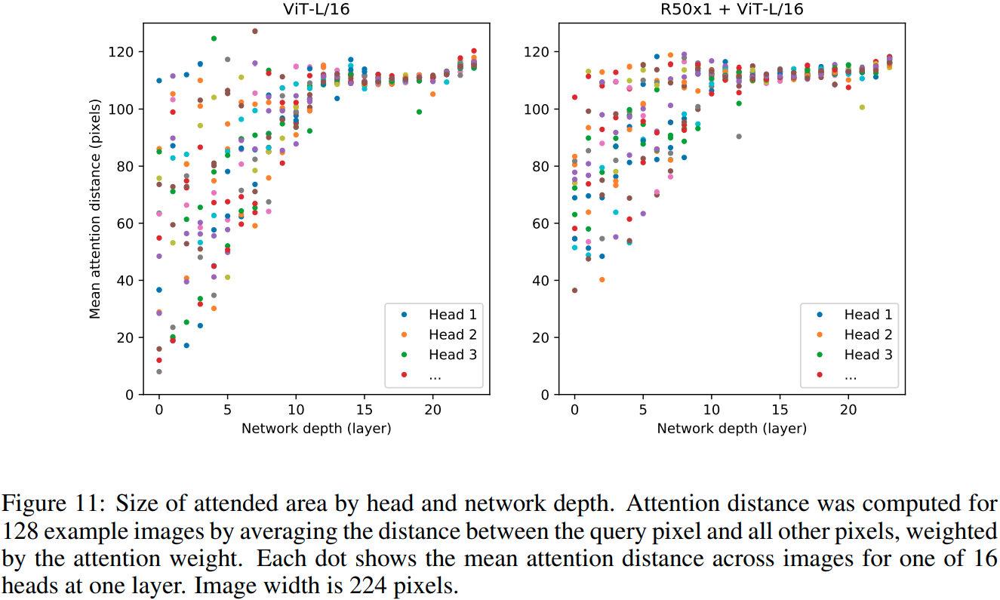

### D.8 ATTENTION MAPS

为了计算从输出 token 到输入空间的注意力映射（图 6 和 14），我们使用了 Attention Rollout (Abnar & Zuidema, 2020)。简而言之，我们对所有头部的 ViT L/16 注意力权重进行平均，然后递归地乘以所有层的权重矩阵。这说明了所有层中 token 之间注意力的混合。

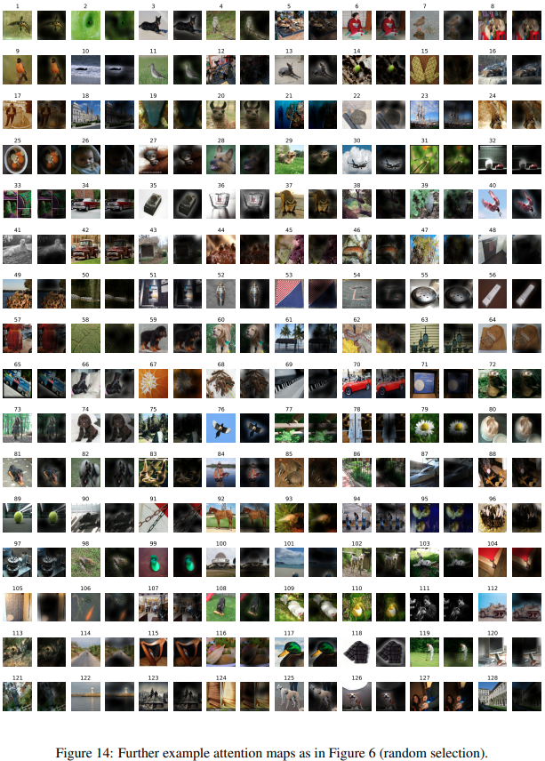

### D.9 OBJECTNET RESULTS

我们还按照 Kolesnikov 等人(2020)的评估设置在 ObjectNet 基准测试上评估我们的旗舰 ViT-H/14 模型，导致 82.1% 的 top-5 准确率和 61.7% 的 top-1 准确率

### D.10 VTAB BREAKDOWN

表 9 显示了在每个 VTAB-1k 任务上获得的分数。

